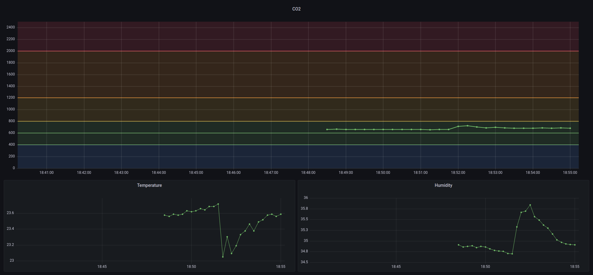
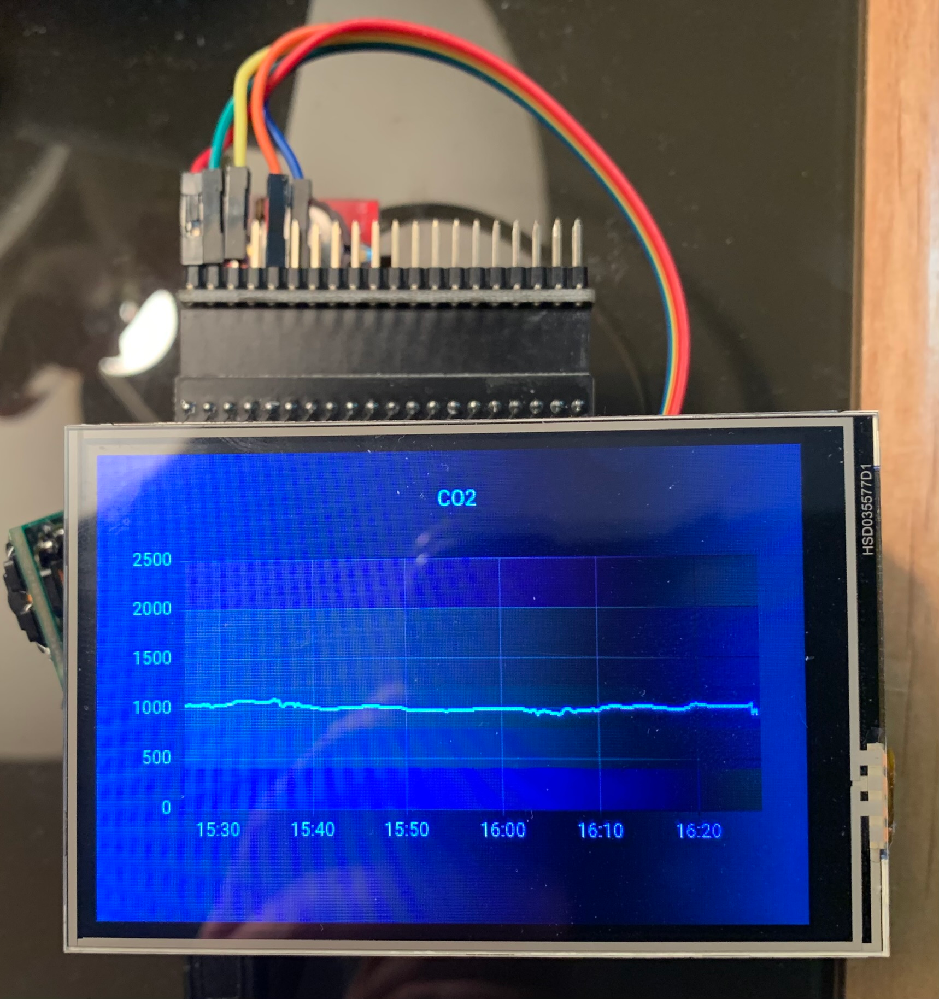
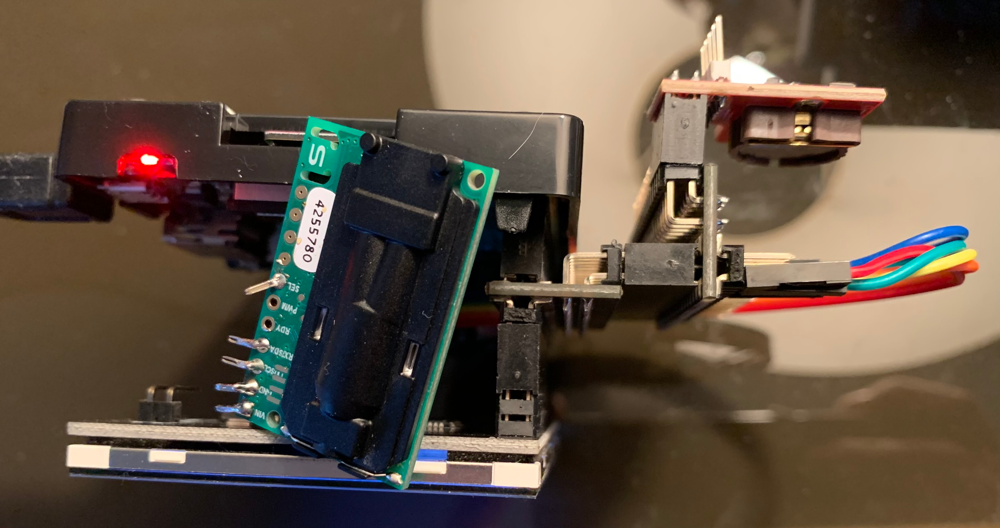

# piCO2-exporter

Python exporter for SCD30 sensor on Raspberry pi

## Requirement

Enable `I2C`:

```sh
sudo raspi-config
```

Then `5 Interfacing Options` –> `P5 I2C` –> `Yes` –> `OK` –> `Finish`

## Build

```sh
git clone https://github.com/gbarre/piCO2-exporter.git
cd piCOE-exporter/
# sudo apt install docker.io
# sudo usermod -aG docker ${USER}
# logout / login
docker build -t pico2-exporter .
```

## Run

```sh
docker run -d -p9983:9983 --restart=unless-stopped --device /dev/i2c-1 --name pico2-exporter pico2-exporter
# You might need to adapt /dev/i2c-1 port...
```

## Test

```sh
docker logs pico2-exporter
2022-01-11 18:41:58,578 - __main__ - INFO - CO2: 650.04ppm, temp: 23.59°C, rh: 34.89%

curl http://localhost:9983
# HELP python_gc_objects_collected_total Objects collected during gc
# TYPE python_gc_objects_collected_total counter
python_gc_objects_collected_total{generation="0"} 377.0
python_gc_objects_collected_total{generation="1"} 0.0
python_gc_objects_collected_total{generation="2"} 0.0
# HELP python_gc_objects_uncollectable_total Uncollectable object found during GC
# TYPE python_gc_objects_uncollectable_total counter
python_gc_objects_uncollectable_total{generation="0"} 0.0
python_gc_objects_uncollectable_total{generation="1"} 0.0
python_gc_objects_uncollectable_total{generation="2"} 0.0
# HELP python_gc_collections_total Number of times this generation was collected
# TYPE python_gc_collections_total counter
python_gc_collections_total{generation="0"} 40.0
python_gc_collections_total{generation="1"} 3.0
python_gc_collections_total{generation="2"} 0.0
# HELP python_info Python platform information
# TYPE python_info gauge
python_info{implementation="CPython",major="3",minor="8",patchlevel="12",version="3.8.12"} 1.0
# HELP process_virtual_memory_bytes Virtual memory size in bytes.
# TYPE process_virtual_memory_bytes gauge
process_virtual_memory_bytes 3.852288e+07
# HELP process_resident_memory_bytes Resident memory size in bytes.
# TYPE process_resident_memory_bytes gauge
process_resident_memory_bytes 1.4790656e+07
# HELP process_start_time_seconds Start time of the process since unix epoch in seconds.
# TYPE process_start_time_seconds gauge
process_start_time_seconds 1.64192305474e+09
# HELP process_cpu_seconds_total Total user and system CPU time spent in seconds.
# TYPE process_cpu_seconds_total counter
process_cpu_seconds_total 2.5900000000000003
# HELP process_open_fds Number of open file descriptors.
# TYPE process_open_fds gauge
process_open_fds 7.0
# HELP process_max_fds Maximum number of open file descriptors.
# TYPE process_max_fds gauge
process_max_fds 1.048576e+06
# HELP probe_co2 Show CO2 ppm metric
# TYPE probe_co2 gauge
probe_co2{firmware_version="834"} 650.8117065429688
# HELP probe_temp Show temp metric
# TYPE probe_temp gauge
probe_temp{firmware_version="834"} 23.39246368408203
# HELP probe_humidity Show humidity metric
# TYPE probe_humidity gauge
probe_humidity{firmware_version="834"} 35.06622314453125
```

## Prometheus

```yaml
---
global:
  scrape_interval:     15s
  evaluation_interval: 15s

scrape_configs:
  - job_name: node
    # If prometheus-node-exporter is installed, grab stats about the local
    # machine by default.
    static_configs:
      - targets: ['localhost:9100']

  - job_name: piCO2
    scrape_interval: 3s
    scrape_timeout: 2s
    static_configs:
      - targets: ['localhost:9983']

```

## Grafana

[See here](./grafana.json) for dashboard example.



## Add RTC module and surprise

In order to keep my Raspberry Pi on time, I added a RTC DS1307 from [kubii](https://www.kubii.fr/cartes-extension-cameras-raspberry-pi/1927-ds1307-horloge-en-temps-reel-avec-batterie-kubii-3272496008007.html). The configuration is quite simple BUT beware, the pins RX and TX that thios module provide are not plugged on the GPIO 2/3 but on the GPIO 14/15 (TXD & RXD). So the connection of the SCD30 sensor can not be done "over" the RTC module. I've solved this problem with [2 Expansion Board 2 x 20-pin Strip Dual Male Header Double Row Straight GPIO Connector](https://www.amazon.fr/gp/product/B08C4S8NPH).

Why 2, because I also plugged [a screen](https://www.amazon.fr/gp/product/B07S8CKW58)! Ok ok, keep cool and breath, this was not so simple.

For the RTC module, `I2C` should already been actived in order to use the SCD30. Then :

```sh
sudo apt update && sudo apt upgrade
sudo apt install python-smbus i2c-tools
sudo i2cdetect -y 1
```

You should see this (the important is `line 60`, `colomn 8`: `68`):

```sh
     0  1  2  3  4  5  6  7  8  9  a  b  c  d  e  f
00: -- -- -- -- -- -- -- -- -- -- -- -- -- -- -- --
10: -- -- -- -- -- -- -- -- -- -- -- -- -- -- -- --
20: -- -- -- -- -- -- -- -- -- -- -- -- -- -- -- --
30: -- -- -- -- -- -- -- -- -- -- -- -- -- -- -- --
40: -- -- -- -- -- -- -- -- -- -- -- -- -- -- -- --
50: -- -- -- -- -- -- -- -- -- -- -- -- -- -- -- --
60: -- -- -- -- -- -- -- -- 68 -- -- -- -- -- -- --
70: -- -- -- -- -- -- -- --
```

If the screen is connected, you will see something quite different but don't worry. Then configure the boot :

```sh
sudo echo "dtoverlay=i2c-rtc,ds3231" >> /boot/config.txt
sudo reboot

## wait...

sudo i2cdetect -y 1
```

The result shoud change for this (`line 60`, `colomn 8`: `UU`):

```sh
     0  1  2  3  4  5  6  7  8  9  a  b  c  d  e  f
00: -- -- -- -- -- -- -- -- -- -- -- -- -- -- -- --
10: -- -- -- -- -- -- -- -- -- -- -- -- -- -- -- --
20: -- -- -- -- -- -- -- -- -- -- -- -- -- -- -- --
30: -- -- -- -- -- -- -- -- -- -- -- -- -- -- -- --
40: -- -- -- -- -- -- -- -- -- -- -- -- -- -- -- --
50: -- -- -- -- -- -- -- -- -- -- -- -- -- -- -- --
60: -- -- -- -- -- -- -- -- UU -- -- -- -- -- -- --
70: -- -- -- -- -- -- -- --
```

Now remove the clock settings, re-enable RTC module:

```sh
sudo apt -y remove fake-hwclock
sudo update-rc.d -f fake-hwclock remove

sudo vim /lib/udev/hwclock-set
```

Change:

```sh
if [ -e /run/systemd/system ] ; then
exit 0
fi
```

To:

```sh
#if [ -e /run/systemd/system ] ; then
#exit 0
#fi
```

After that, check RTC module hour and current date, and if everything is good, write it (and check again).

```sh
sudo hwclock -D -r
date
sudo hwclock -w
sudo hwclock -r
```

Finally, force updating time after boot by adding `sudo hwclock -s` just after the line `# By default this script does nothing`

[RTC configuration source](https://trevilly.com/ajout-dun-module-rtc-au-raspberry-pi/)

## Screen configuration

According to screen documentation:

```sh
sudo rm -rf LCD-show
git clone https://github.com/lcdwiki/LCD-show.git
chmod -R 755 LCD-show
cd LCD-show
sudo ./MHS35-show
```

## What does it Looks like...?




## Cherry on the cake: wifi hotspot

Finally, I wanted to be able to connect to this raspberry pi without having to plug it into my local network. Indeed, I carry it everywhere and I do not want to spend my time to seek its ip on the various local networks. And then level of safety, it is better not to connect anywhere, you never know...

So I installed [raspap](https://github.com/RaspAP/raspap-webgui).

## Next ?

The next steps will be:

1. Test it with a battery
2. Make a protective case
